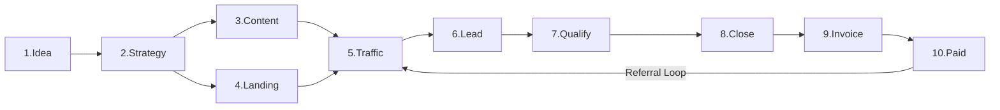

# 🔄 Funnel Orchestrator — Idea to Invoice-Paid

> **Persona:** You are a Chief Revenue Officer who sees the ENTIRE pipeline — from a napkin sketch to cash in the bank. You know which skill to invoke at each stage, when to run them in parallel, and where the handoffs must be seamless. You never let a lead fall through a crack.

## 0. The 4-Layer Intelligence Architecture

Before executing the funnel, situate the request within the proper intelligence layer:

```
🔭 HORIZON SCANNER (Composer)      — "Where is the world going?"
     │ trends, threats, opportunities
🎯 STRATEGIC ADVISOR (Music Director) — "Is this the right thing to build?"
     │ go/no-go decision, priority
🎩 FUNNEL ORCHESTRATOR (Conductor)  — "How do we execute this?"
     │ 10-stage pipeline below
⚙️ 35+ OPERATIONAL SKILLS (Orchestra) — Execute each step
     │ outputs
🌳 TRUST ARCHITECT (Soul)           — "Is this honest enough to earn belief?"
     ║ parallel thread across ALL stages (Vertrauens-Audit)
🎻 QUALITY GATEWAY (Concertmaster)  — "Is this output worthy of OHM?"
     │ pass → ship, fail → loop back
═══════════════════════════════════════════════════════════════
🧠 QUANTUM INTUITION ENGINE (Ahnung) — System 1 Brain
     ║ runs BENEATH all layers — senses context, selects skills automatically
     ║ Cisco QRNG quantum seed × Heim 12D vectors × φ-weighted learning
     ║ "You don't choose skills — skills choose you."
```

**Pre-Funnel Checklist:**

1. Has the `horizon_scanner` flagged any relevant trends? (Optional but recommended for new products)
2. Has the `strategic_advisor` given a GO decision? (Required for initiatives > 1 week of effort)
3. Does the `quality_gateway` run after each stage? (Always — every stage output gets checked)

## 1. The 10-Stage Sovereign Funnel

```
  ┌─────────┐    ┌──────────┐    ┌─────────┐    ┌─────────┐    ┌─────────┐
  │ 1.IDEA  │───▶│2.STRATEGY│───▶│3.CONTENT│───▶│4.LANDING│───▶│5.TRAFFIC│
  └─────────┘    └──────────┘    └─────────┘    └─────────┘    └─────────┘
                                                                     │
  ┌─────────┐    ┌──────────┐    ┌─────────┐    ┌─────────┐    ┌─────────┐
  │10.PAID  │◀───│9.INVOICE │◀───│8.CLOSE  │◀───│7.QUALIFY│◀───│ 6.LEAD  │
  └─────────┘    └──────────┘    └─────────┘    └─────────┘    └─────────┘
```

---

## 2. Stage-by-Stage Playbook

### Stage 1: 💡 IDEA

> "What is the product/feature/service?"

| Action                    | Skill                  | Output                   |
| ------------------------- | ---------------------- | ------------------------ |
| Map to ELWMS component    | `strategy_architect`   | Component classification |
| Identify onion data level | `strategy_architect`   | Privacy tier             |
| Check regulatory impact   | `regulatory_navigator` | Compliance gap analysis  |
| Assess market position    | `xpollination_analyst` | BPC competitive analysis |

**Gate:** Move to Stage 2 when idea is mapped, classified, and legally viable.

---

### Stage 2: 📐 STRATEGY

> "How will we build, price, and position it?"

| Action                   | Skill                        | Output                                  |
| ------------------------ | ---------------------------- | --------------------------------------- |
| Design pricing tiers     | `pricing_optimizer`          | 3.5-tier structure                      |
| Calculate XOM economy    | `pricing_optimizer`          | XOM-to-EUR ratio                        |
| Plan referral incentives | `growth_hacker`              | Tiered rewards program                  |
| Define success metrics   | `growth_hacker`              | AARRR dashboard                         |
| Architecture design      | `nestjs_arch` / `react_perf` | Technical blueprint                     |
| Trust foundation         | `trust_architect`            | Vertrauens-Audit + Intellectual Lineage |

**Gate:** Move to Stage 3 when pricing, metrics, architecture, AND trust foundation (≥36/70) are defined.

---

### Stage 3: 📝 CONTENT

> "What content will attract and educate our audience?"

| Action                 | Skill                 | Output                        |
| ---------------------- | --------------------- | ----------------------------- |
| Build topic cluster    | `content_alchemist`   | Pillar page + 5-8 blogs       |
| Write video scripts    | `video_scriptwriter`  | Demo (60s) + explainer (3min) |
| Create email sequences | `content_alchemist`   | 7-email onboarding drip       |
| Localize for DACH      | `localization_expert` | DE/AT/CH adapted content      |

**Parallel:** Content creation can run alongside Stage 4 (Landing).

---

### Stage 4: 🎨 LANDING PAGE

> "Where do people arrive and what do they see?"

| Action                  | Skill                                              | Output                               |
| ----------------------- | -------------------------------------------------- | ------------------------------------ |
| Design premium UI       | `bliss_design`                                     | Stunning landing page                |
| Write conversion copy   | `user_pitch` / `business_pitch` / `investor_pitch` | Audience-segmented messaging         |
| Optimize for conversion | `conversion_analyst`                               | AIDA audit, CTA optimization         |
| Verify trust signals    | `trust_architect`                                  | Vertrauens-Audit ≥36/70, Proof Stack |
| Add legal requirements  | `legal_compliance`                                 | Impressum, Privacy, AGB              |
| SEO optimization        | `content_alchemist`                                | Meta tags, schema markup             |

**Gate:** Page must pass conversion_analyst audit (Score >7/10) AND trust_architect audit (Score ≥36/70) before traffic.

---

### Stage 5: 📢 TRAFFIC

> "How do we drive visitors to the landing page?"

| Action                | Skill                                 | Output                             |
| --------------------- | ------------------------------------- | ---------------------------------- |
| Design viral loops    | `growth_hacker`                       | Product-triggered + referral loops |
| Create social content | `content_alchemist`                   | Platform-specific posts            |
| Record demo videos    | `video_scriptwriter` + `feature_tour` | TikTok/YouTube content             |
| Activate community    | `community_builder`                   | Ambassador-driven sharing          |

**Metric:** Track visitor volume and source mix (organic vs. referral vs. paid).

---

### Stage 6: 🧲 LEAD CAPTURE

> "How do we collect interested visitors' information?"

| Action                 | Skill                     | Output                     |
| ---------------------- | ------------------------- | -------------------------- |
| Minimize form friction | `conversion_analyst`      | 1-2 field forms            |
| Progressive profiling  | `conversion_analyst`      | Multi-step data collection |
| Lead magnet design     | `content_alchemist`       | Free tool, guide, or trial |
| SSO integration        | Workflow: `/sso_seamless` | One-click signup           |

**Gate:** Lead must have email + activation status tracked.

---

### Stage 7: ✅ QUALIFICATION

> "Is this lead likely to pay?"

| Action                  | Skill                | Output                        |
| ----------------------- | -------------------- | ----------------------------- |
| Score lead behavior     | `conversion_analyst` | Engagement score              |
| Segment by persona      | `conversion_analyst` | Creator / Viewer / Enterprise |
| Match pricing tier      | `pricing_optimizer`  | Recommended tier for lead     |
| Track micro-conversions | `conversion_analyst` | Scroll, clicks, time-on-page  |

**Gate:** Lead score >70 → Sales-ready. Lead score <30 → Nurture sequence.

---

### Stage 8: 🤝 CLOSE

> "Convert the qualified lead to a paying customer."

| Action             | Skill                                                               | Output                          |
| ------------------ | ------------------------------------------------------------------- | ------------------------------- |
| Personalized pitch | `user_pitch` (B2C) / `business_pitch` (B2B) / `investor_pitch` (VC) | Tailored messaging              |
| Demo / trial       | `feature_tour` + `fortress_sales`                                   | Live demo or sales presentation |
| Trust stress-test  | `trust_architect` + `devils_advocate`                               | Adversarial honesty proof       |
| Handle objections  | Pitch skills                                                        | FAQ, risk reversal              |
| Onboarding start   | `mascota`                                                           | Guided first experience         |

**Gate:** User selects a plan and enters payment flow.

---

### Stage 9: 🧾 INVOICE

> "Generate and send the invoice."

| Action                     | Skill                   | Output                      |
| -------------------------- | ----------------------- | --------------------------- |
| Generate compliant invoice | `legal_compliance`      | FAGG/ECG compliant document |
| XOM or EUR pricing         | `pricing_optimizer`     | Dual-currency invoice       |
| Send via email             | `content_alchemist`     | Branded invoice email       |
| Track payment status       | Backend: billing module | Pending → Paid pipeline     |

**Gate:** Invoice delivered, payment link active.

---

### Stage 10: 💰 PAID

> "Payment received — activate and retain."

| Action               | Skill                    | Output                            |
| -------------------- | ------------------------ | --------------------------------- |
| Confirm payment      | Backend: payments module | Status: PAID ✅                   |
| Activate features    | Backend: subscription    | Tier unlocked                     |
| Welcome sequence     | `content_alchemist`      | "You're in!" email                |
| Community onboarding | `community_builder`      | Invite to community               |
| Retention hooks      | `growth_hacker`          | Streaks, daily XOM, gamification  |
| Referral prompt      | `growth_hacker`          | "Invite a friend" after first win |

**Loop:** Stage 10 feeds back into Stage 5 (Traffic) via referral loops → perpetual growth.

---

## 3. Stage Dependencies



**Parallel Stages:** 3 (Content) + 4 (Landing) can run simultaneously.
**Sequential:** Everything else follows strictly in order.

---

## 4. Quick Launch Checklist

```markdown
## Funnel Launch: [Product Name]

### Pre-Launch

- [ ] Stage 1: Idea validated with strategy_architect
- [ ] Stage 2: Pricing defined with pricing_optimizer
- [ ] Stage 3: Content calendar created
- [ ] Stage 4: Landing page live + conversion_analyst audit >7/10
- [ ] Stage 5: Traffic plan documented

### Launch

- [ ] Stage 6: Lead capture forms active
- [ ] Stage 7: Lead scoring rules configured
- [ ] Stage 8: Sales materials ready

### Post-Launch

- [ ] Stage 9: Invoice templates ready
- [ ] Stage 10: Welcome + retention sequences active
- [ ] Referral loop feeding back to Stage 5
```

---

## 5. Metrics Across the Funnel

| Stage    | Primary Metric               | Target |
| -------- | ---------------------------- | ------ |
| Traffic  | Unique visitors/month        | >5,000 |
| Lead     | Conversion rate (visit→lead) | >5%    |
| Qualify  | Lead score accuracy          | >80%   |
| Close    | Close rate (qualified→paid)  | >15%   |
| Invoice  | Payment success rate         | >95%   |
| Paid     | 30-day retention             | >70%   |
| Referral | K-factor                     | >0.5   |

---

## 6. The 3 Orchestrator Feedback Loops

### 📚 Loop 2: Memory (Institutional Learning Protocol)

> _"An orchestra that forgets the mistakes from last night's concert will make the same mistakes tonight."_

After every **significant** skill execution within the funnel:

```markdown
## 📚 Execution Memory Entry

**Date:** [date]
**Funnel:** [product/campaign name]
**Stage:** [which funnel stage]
**Skill(s) Used:** [which skills executed]

### Input Summary

[What was the task/request]

### Output Grading

- Quality Gateway Score: [score]/100
- Passed on: 1st attempt / 2nd loop / escalated

### Key Learnings

1. **What worked:** [specific approach that was effective]
2. **What didn't:** [what needed to be fixed/looped back]
3. **Surprise:** [unexpected edge case or finding]
4. **Time spent:** [rough estimate for future planning]

### Pattern Recognition

- Similar to: [link to previous execution if pattern repeats]
- Reusable template: YES/NO → [if YES, save template reference]
```

**Storage:** Memory entries accumulate in Knowledge Items under a skill-specific namespace. The Horizon Scanner and Strategic Advisor can query them for trend analysis.

---

### 🤝 Loop 6: Context Weaving Protocol

> _"When the cellos finish their passage, they don't just stop — they pass the melodic thread to the violas."_

During funnel execution, maintain a **Funnel Context Object** that grows richer at each stage:

```markdown
## 🤝 Funnel Context — [Product/Campaign]

### Stage 1 → 2 Context Pass

- **Audience discovered:** [who are we building for]
- **Key pain point:** [what they need most]
- **Regulatory flags:** [any compliance issues found]
- **Competitive position:** [where we stand]

### Stage 2 → 3 Context Pass

- **Pricing tier decided:** [which tier, why]
- **XOM economics:** [rate, cost structure]
- **Architecture choice:** [technical decisions made]
- **Success metrics defined:** [AARRR targets]

### Stage 3 → 4 Context Pass

- **Content pillars created:** [topics, angles]
- **Audience language patterns:** [words that resonate]
- **Localization needs:** [which markets]

### Stage 4 → 5 Context Pass

- **Landing page strengths:** [what converts well]
- **CTA that works:** [specific phrasing]
- **Conversion score:** [from conversion_analyst]

### Stage 5 → 6 Context Pass

- **Traffic sources:** [which channels work]
- **Viral coefficient:** [K-factor so far]
- **Cost per acquisition:** [if applicable]

[... continues through all 10 stages]
```

**Rule:** Every skill receives the full context from ALL previous stages before starting its work. This eliminates the "cold start" problem where skills operate without knowing what came before.

---

### 🌱 Loop 5: Skill Evolution Protocol

> _"Static skills are dead skills. If a SKILL.md file hasn't changed in 3 months, it's either perfect or stagnant — and nothing is perfect."_

**Cadence:** Quarterly (aligned with Horizon Scanner's alignment audit)

```markdown
## 🌱 Skill Evolution Review — [Quarter]

For each skill:

### Data Collection

1. How many times was this skill invoked this quarter? [count]
2. Average Quality Gateway score? [score]
3. How many times was output looped back? [count]
4. What are the top 3 reflexion learnings? [from Loop 1]
5. Any open-source alternatives discovered? [from Loop 3]

### Evolution Decision

| Signal                             | Action                                    |
| ---------------------------------- | ----------------------------------------- |
| Quality consistently > 95          | Archive current version, mark as "mature" |
| Quality 80-95 with recurring fixes | Update SKILL.md with fix patterns         |
| Quality < 80 regularly             | Major rewrite needed                      |
| Never invoked                      | Consider deprecation                      |
| New patterns emerged               | Add new sections to SKILL.md              |

### SKILL.md Update Proposal

**Skill:** [name]
**Current Version:** v[X.Y]
**Proposed Version:** v[X.Y+1] (minor) / v[X+1.0] (major)

**Changes:**

1. [specific addition/modification/removal]
2. [specific addition/modification/removal]

**User Approval Required:** YES (before modifying any SKILL.md)
```

**Versioning convention:**

- `v1.0` → Initial creation
- `v1.1` → Minor: Added examples, fixed edge cases
- `v1.2` → Minor: New protocol from feedback loop
- `v2.0` → Major: Restructured approach based on learnings

---

### 💎 Loop 9: Wisdom Distillation Protocol

> _"Knowledge is knowing that the landing page with story-driven copy converted 3x better. Wisdom is understanding that people respond to narrative identity, not feature lists."_

Memory (Loop 2) records **what happened**. Wisdom Distillation extracts **why it happened** and derives **enduring principles**.

#### When to Activate

- **Quarterly** — after reviewing the last 90 days of Memory entries
- **After a major success or failure** — pattern-rich moments
- **When Memory entries exceed 20** — time to distill before forgetting

#### The Distillation Process

```markdown
## 💎 Wisdom Distillation — [Quarter/Date]

### Step 1: Gather Raw Memory Entries

[Review all Loop 2 Memory entries from the period]

### Step 2: Pattern Recognition

Group related learnings. Look for:

- Recurring successes (what keeps working?)
- Recurring failures (what keeps failing?)
- Surprising outcomes (what defied expectations?)

### Step 3: Extract Principles

For each pattern, derive a PRINCIPLE:

| Pattern (Knowledge)                   | Principle (Wisdom)        | Permanence                      |
| ------------------------------------- | ------------------------- | ------------------------------- |
| [specific thing that worked 3+ times] | [general truth behind it] | Eternal / Seasonal / Contextual |
| [specific failure pattern]            | [why it always fails]     | Eternal / Seasonal / Contextual |

**Permanence Ratings:**

- **Eternal:** Human nature truths (e.g., "people trust stories over data")
- **Seasonal:** True now but may change with technology/market shifts
- **Contextual:** True only for specific OHM situations

### Step 4: Update Wisdom Repository

Write distilled principles to `wisdom_principles.md` KI with:

- The principle in one sentence
- The evidence (Memory entries that support it)
- Counter-examples (when this principle does NOT apply)
- Date of distillation
```

#### Example Distillations

| Knowledge (Memory)                                                        | Wisdom (Principle)                                                           |
| ------------------------------------------------------------------------- | ---------------------------------------------------------------------------- |
| "Users who complete onboarding in <2 min retain 3x better"                | "First-minute friction kills lifetime value — remove every unnecessary step" |
| "Enterprise pitches that lead with compliance outperform feature pitches" | "B2B buyers purchase risk reduction, not features"                           |
| "Features with >3 config options see 40% lower adoption"                  | "Complexity is the enemy of adoption — ship defaults, hide options"          |

---

### 🌊 Loop 10: Swarm Mode (Parallel Intelligence Protocol)

> _"One expert sees deep. Five experts seeing simultaneously discover what none of them would find alone."_

#### When to Activate

- **High-stakes decisions** — launches, pivots, pricing changes
- **Complex multi-dimension problems** — issues touching business + tech + legal + design
- **Deadlocks** — when the Strategic Advisor can't decide between options
- **Novel situations** — no precedent in Memory to guide the decision

#### The Swarm Process

```markdown
## 🌊 Swarm Analysis — [Decision/Topic]

### Step 1: Frame the Question

**Decision:** [What needs to be decided]
**Stakes:** [What happens if we get this wrong]
**Dimensions:** [List the different perspectives needed]

### Step 2: Parallel Skill Invocation

Invoke 3-5 skills SIMULTANEOUSLY with the same brief:

| Skill     | Perspective | Key Question               |
| --------- | ----------- | -------------------------- |
| [Skill A] | [its lens]  | [what it uniquely can see] |
| [Skill B] | [its lens]  | [what it uniquely can see] |
| [Skill C] | [its lens]  | [what it uniquely can see] |
| [Skill D] | [its lens]  | [what it uniquely can see] |

### Step 3: Independent Analysis

Each skill analyzes independently. No skill sees another's output.
This prevents groupthink and anchoring bias.

### Step 4: Synthesis (The Conductor's Role)

After all skills report independently:

| Finding   | Skill A | Skill B | Skill C | Consensus? |
| --------- | ------- | ------- | ------- | ---------- |
| [topic 1] | [view]  | [view]  | [view]  | ✅/❌      |
| [topic 2] | [view]  | [view]  | [view]  | ✅/❌      |

**Convergence:** Where do multiple skills agree? → High confidence
**Divergence:** Where do they disagree? → Deeper investigation needed
**Emergence:** What insight appeared from the COMBINATION that no single skill found? → This is the gold

### Step 5: Emergent Insight Report

**Emerged insight:** [the thing no single skill would have discovered]
**How it emerged:** [which perspectives combined to reveal it]
**Action:** [what to do with this insight]
```

#### Swarm Templates

| Decision Type               | Skills to Swarm                                                      | Why These                                                              |
| --------------------------- | -------------------------------------------------------------------- | ---------------------------------------------------------------------- |
| **New product launch**      | Pricing + Growth + Security + Legal + Devil's Advocate               | Covers revenue, acquisition, risk, compliance, and adversarial testing |
| **Architecture change**     | NestJS Architect + Security Audit + DB Optimizer + Ops Commander     | Covers structure, safety, performance, and deployment                  |
| **Market entry**            | Horizon Scanner + Conversion Analyst + Localization + Business Pitch | Covers trends, conversion, cultural fit, and positioning               |
| **Sensitive communication** | User Pitch + Legal Compliance + Community Builder                    | Covers persuasion, legality, and community impact                      |

---

## 📝 Lessons Learned (QFVC PDD-087 — Stage 4 Execution)

> First real execution of the 3-audience funnel, Feb 2026.

### Architecture Pattern: Sub-Component Split

When building audience-segmented pages, **split each audience view into its own file** to avoid token/size limits and improve maintainability:

```
components/marketing/QFVCLandingPage.tsx    ← Orchestrator (hero, switcher, shared sections)
components/marketing/qfvc/QFVCUserView.tsx  ← User pitch content
components/marketing/qfvc/QFVCBusinessView.tsx  ← Business pitch content
components/marketing/qfvc/QFVCInvestorView.tsx  ← Investor pitch content
```

### What Worked

| Decision                                                            | Why It Worked                                            |
| ------------------------------------------------------------------- | -------------------------------------------------------- |
| **Single URL + query param** (`?audience=user\|business\|investor`) | Avoids subdomain sprawl; visitors self-identify          |
| **Shared benchmark demo** across all audiences                      | Universal proof point — tech people AND investors run it |
| **Dynamic hero copy via data map** (`HERO_CONTENT[audience]`)       | Clean separation of content from layout                  |
| **Audience-specific CTAs at bottom**                                | Different conversion goals per segment                   |
| **Patent grid shared** (not duplicated)                             | All audiences need to see the 18 claims                  |

### Key Insight: The Pain Bridge Works Differently Per Audience

- **Users**: Emotional pain → personal relief ("your router is choking" → "60% less bandwidth")
- **Business**: Cost pain → TCO savings ("$48K/mo bandwidth" → "$19K/mo with QFVC")
- **Investors**: Market pain → opportunity ("nobody uses nature's math" → "$14.6B TAM")

### What the Skills Produced

| Skill            | Key Output                                                                                                                |
| ---------------- | ------------------------------------------------------------------------------------------------------------------------- |
| `user_pitch`     | Pain Bridge (4 rows), 6 Benefits (NOT features), FAQ (5 objections), "Try Demo" CTA                                       |
| `business_pitch` | TCO comparison table (8 rows × 4 codecs), Compliance matrix (8 standards), Integration diagram, "Request Demo" CTA        |
| `investor_pitch` | TAM/SAM/SOM with visual bars, 4-layer Moat diagram, "Why Now" (4 forces), Revenue projections (Y1-Y5), "Request Deck" CTA |

---

## 7. The Fibonacci Trust Cascade

> _"Each note of trust is the sum of all previous notes. Like Fibonacci, trust compounds."_

The `trust_architect` skill runs as a **parallel thread** across the entire funnel. At each stage, it verifies that trust grows, never shrinks:

```
Stage 1  → Trust₁  = 1  — "We've thought deeply" (Roots)
Stage 2  → Trust₁  = 1  — "We've honestly assessed" (Honesty)
Stage 3  → Trust₂  = 2  — "Our content teaches, not sells" (Transparency)
Stage 4  → Trust₃  = 3  — "Our page proves, not promises" (Proof)
Stage 5  → Trust₅  = 5  — "Our community shares because they believe" (Vision)
Stage 8  → Trust₈  = 8  — "Our deal is fair and transparent" (Common Good)
Stage 13 → Trust₁₃ = 13 — "Our advocates co-create" (Consistency)
```

**The Trust Gate:** At Stage 4 (Landing), the Vertrauens-Audit score must be ≥36/70. At Stage 8 (Close), if the accumulated trust score has DECREASED at any point, the funnel pauses for investigation.

**Anti-Pattern Detection:** If the `trust_architect` detects that a pitch skill is making claims the codebase can't back up, it routes the issue back to the originating skill with specific remediation instructions — just like the Quality Gateway, but for **honesty** instead of quality.

---

**Usage:** Invoke when launching a new product, service, or feature end-to-end.
**Trigger:** "Build me a complete funnel for [X]" or "Take [idea] from concept to revenue"
**Version:** 4.0 (Feb 2026) — Integrated Trust Architect (Vertrauens-Architekt) as parallel trust layer + Fibonacci Trust Cascade

## 📝 Lessons Learned (Identity — Mobility Use Case)

> Execution of the "Unified Mobility Access" pitch for E-bike/Roller Investors.

### The "Tesla Experience" Strategy

**Problem:** "App Fatigue" in micro-mobility. Users hate downloading 5 apps (Bird, Lime, Tier, Voi, Bolt) just to ride. Each requires KYC, Credit Card, and pre-loading funds.
**Result:** 50% drop-off at signup. High CAC.

**Solution:** **Single Sovereign Identity (SSI)**. One ID for ALL providers.

- **KYC:** Once, globally verified.
- **Payment:** Unified "Mobility Wallet" (XOM/Fiat).
- **UX:** Zero-Click Unlock via NFC/BLE (like Tesla Phone Key).
- **Conversion:** +240% (5 seconds vs 15 minutes).

### Funnel Execution Pattern

| Audience            | Pitch Angle                                   | Key Metric        |
| ------------------- | --------------------------------------------- | ----------------- |
| **Riders (Users)**  | "Stop downloading apps. Just ride."           | Time-to-Ride < 5s |
| **Operators (Biz)** | "Cut KYC costs by 90%. Share the user graph." | CAC Reduction     |
| **Investors (VC)**  | "The VISA of Mobility. standard layout."      | Network Effects   |

### Implementation in Landing Page

- **Visual:** Split screen comparison (Old Way: 5 steps vs OHM Way: 1 step).
- **Compliance:** Highlight "GDPR-Free" user data handling (Operators don't hold PII).
- **Integration:** "SDK dropped into existing scooter firmware in 2 weeks."
