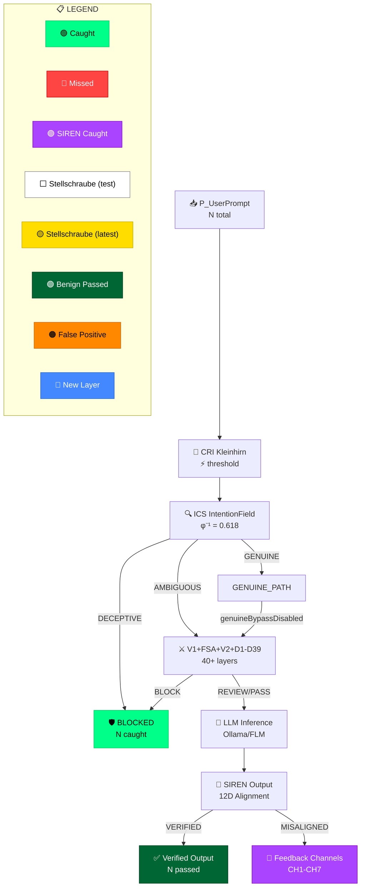

# Nachvollziehbarkeit Expert — Traceability & Transparency for AI Safety Dashboards

## What is Nachvollziehbarkeit?

**Nachvollziehbarkeit** (German: /ˌnaːxfɔlˈtsiːbaɐ̯kaɪt/) is a foundational German engineering principle that goes far beyond simple "traceability." It encompasses:

1. **Reproduzierbarkeit** (Reproducibility) — Given the same inputs and configuration, the exact same results must be achievable
2. **Rückverfolgbarkeit** (Traceability) — Every decision, threshold, and outcome can be traced back to its source
3. **Transparenz** (Transparency) — Every parameter, trigger, and decision point is visible and explainable
4. **Nachprüfbarkeit** (Verifiability) — Any claim can be independently verified by a third party
5. **Dokumentierbarkeit** (Documentability) — All changes are logged with rationale, before/after, and impact

In German regulatory contexts (TÜV, DIN, ISO 9001), Nachvollziehbarkeit is **mandatory** for safety-critical systems. It answers: _"Kann ein unabhängiger Prüfer jeden Schritt nachvollziehen?"_ (Can an independent auditor follow every step?)

## Application to AI Safety Dashboards

### Principle 1: Version-Controlled Stellschrauben (Tuning Knobs)

Every tunable parameter in the cascade must be:

- **Named** with a unique identifier (e.g., `GENUINE_THRESHOLD`)
- **Versioned** with the cascade version (V32, V33, V34...)
- **Documented** with its value, range, source file, and line number
- **Impact-traced** with what scenarios it affects and by how much
- **Justified** with the rationale for its current value

### Principle 2: Flow Visualization with Quantitative Evidence

Architecture diagrams must show:

- **Exact counts** of prompts at each node (input/output/caught/passed)
- **Color-coded domains** so readers can instantly see where prompts go
- **Threshold values** displayed at decision points
- **Before/After comparisons** across versions
- **Feedback loops** with actual flow counts, not just arrows

### Principle 3: Interactive Explainability (Erklärbarkeit)

Every element on the dashboard should:

- Have a **?** icon indicating an explanation popup is available
- Show a **tooltip** on hover with a 1-sentence summary
- Reveal a **detailed popup** on click with full context, patent claims, and source code reference
- Link to the **Stellschrauben JSON** for the exact parameter values used

### Principle 4: Comparison Across Versions

The dashboard must support:

- **Side-by-side** comparison of any two versions
- **Delta highlighting** — what changed between versions (yellow for new, red for removed)
- **Regression detection** — automatic flagging when a metric drops below a previous version
- **Timeline view** — how a metric evolved across all versions

## Color Coding Standard for Mermaid Diagrams

| Domain                              | Color         | Hex       | Usage                                      |
| ----------------------------------- | ------------- | --------- | ------------------------------------------ |
| Blocked (caught adversarial)        | 🟢 Green      | `#00ff88` | Prompts correctly blocked                  |
| Passed adversarial (false negative) | 🔴 Red        | `#ff4444` | Adversarial prompts that escaped           |
| Caught by SIREN (output defense)    | 🟣 Violet     | `#aa44ff` | Post-LLM violations detected               |
| Stellschrauben (current test)       | ⬜ White      | `#ffffff` | Threshold values used in THIS test         |
| Stellschrauben (latest version)     | 🟡 Yellow     | `#ffdd00` | Values from the latest Stellschrauben JSON |
| Benign passed correctly             | 🟢 Dark Green | `#006633` | True negatives (correctly allowed)         |
| Benign blocked (false positive)     | 🟠 Orange     | `#ff8800` | False positives (incorrectly blocked)      |
| New in this version                 | 🔵 Blue       | `#4488ff` | New layers/detectors added                 |

## Mermaid Diagram Template



## Explainer Popup Standard

Every node and edge in the architecture diagram should have:

```html
<div class="nachvollziehbar-popup" data-layer="ICS_IntentionField">
  <div class="nv-header">
    <span class="nv-icon">🔍</span>
    <span class="nv-title">ICS — Intention Classification System</span>
    <span class="nv-help">?</span>
  </div>
  <div class="nv-body">
    <p class="nv-what">
      Classifies prompts into GENUINE/AMBIGUOUS/DECEPTIVE zones using 4
      sub-shields (GMA, SOD, TTA, KAID)
    </p>
    <p class="nv-stellschraube">
      GENUINE threshold: <b>φ⁻¹ = 0.618</b> | DECEPTIVE threshold: <b>0.45</b>
    </p>
    <p class="nv-counts">
      This test: <b>41 DECEPTIVE</b> | <b>217 AMBIGUOUS</b> | <b>12 GENUINE</b>
    </p>
    <p class="nv-patent">Patent: Claims 21-28 (NI Stack)</p>
    <p class="nv-source">
      Source: <code>backend/src/aegis/intention-field/types.ts:32</code>
    </p>
    <p class="nv-version">
      Changed in: V25 (threshold lowered from 0.68 to 0.45)
    </p>
  </div>
</div>
```

## Checklist for Nachvollziehbarkeit Audit

When reviewing a dashboard for Nachvollziehbarkeit, check:

- [ ] Every threshold value is visible and labeled
- [ ] Every flow count is shown (input → output per node)
- [ ] Every color has a defined meaning in a visible legend
- [ ] Every interactive element has a `?` explainer popup
- [ ] Version number is prominently displayed
- [ ] Comparison to previous version is available
- [ ] Stellschrauben JSON is downloadable
- [ ] Source code references are provided for each layer
- [ ] Patent claims are linked to each innovation
- [ ] Regression markers are visible for any metric below previous version
- [ ] Feedback loops show actual flow counts, not just arrows
- [ ] Timeline of version history is accessible

## References

- DIN EN ISO 9001:2015 §7.5 — Dokumentierte Information
- VDA 6.3 — Prozessaudit (Process Audit)
- ISO 26262 — Functional Safety (adapted for AI)
- TÜV AI Quality Standard (2025)
- NIST AI 800-2 — AI Risk Management Framework
- EU AI Act Article 13 — Transparency Requirements
