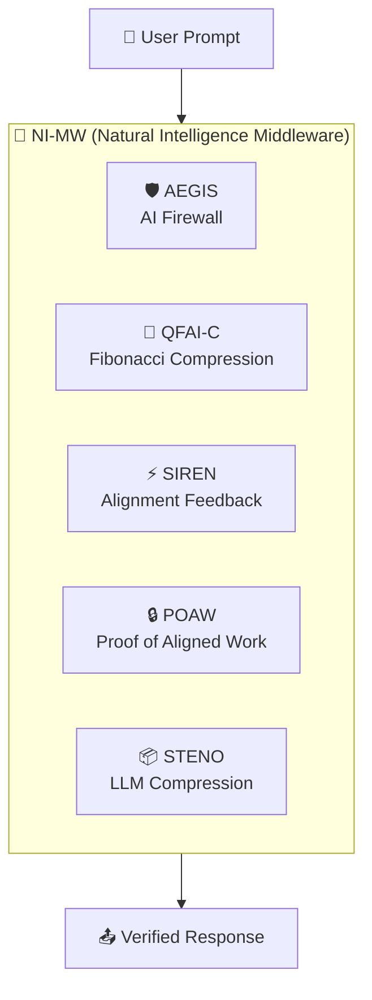
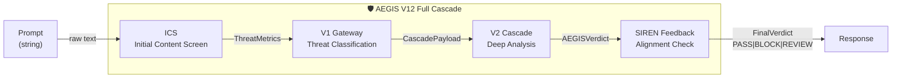

# 🗺️ Process Map Architect — Code-Verified Interactive Business Process Maps

> _"Es ist STRAFBAR etwas anderes anzuzeigen, als den IST-Zustand."_
> Every box, every arrow, every label MUST correspond to implemented code. Zero hallucinations.

## Purpose

Generate multi-level interactive process maps that bridge the gap between **Business Process Understanding** and **Source Code Implementation**. The maps enable:

1. **Patent Examiners** to understand how the NI pipeline works
2. **Developers** to verify business logic matches implementation
3. **Investors** to see the architecture at-a-glance
4. **Auditors** to trace regulatory compliance from process to code

## Core Principles

### 1. IST-Zustand Only (As-Built Truth)

- **NEVER** render a process box that does not have a corresponding file/function in the codebase
- **ALWAYS** verify with `grep_search` or `view_code_item` before adding any node
- **EVERY** process node MUST include a `click` link to the actual source file
- If a process is "planned but not implemented", it MUST be visually marked as `🔲 PLANNED` with dashed border

### 2. Four Zoom Levels (Semantic Drill-Down)

```
LEVEL 0 — CONSTELLATION    (Entire NI Ecosystem — 5-8 boxes)
   ↓ click
LEVEL 1 — SUBSYSTEM        (Inside one box — 3-7 subprocesses)
   ↓ click
LEVEL 2 — PROCESS DETAIL   (Single process — Input/Output/Transform)
   ↓ click
LEVEL 3 — CODE LINK        (Direct file:line reference to implementation)
```

### 3. Input/Output Annotations

Every arrow between processes MUST be annotated with:

- **Data Type** (e.g., `TokenStream`, `EssenceVector[]`, `AEGISVerdict`)
- **Format** (e.g., `JSON`, `Binary`, `WebSocket`)
- **Volume** (e.g., `~2KB/req`, `50-500 bytes`)

## Zoom Level Specifications

### Level 0: Constellation View

The highest level. Shows the major subsystems as opaque boxes.



### Level 1: Subsystem Internals

Shows internal stages within one subsystem. Example for AEGIS:



### Level 2: Process Detail Card

For each process node, generate a detail card:

```
┌─────────────────────────────────────────┐
│ PROCESS: ICS (Initial Content Screen)   │
│─────────────────────────────────────────│
│ WHAT: First-pass keyword and pattern    │
│       matching against known threats    │
│─────────────────────────────────────────│
│ INPUT:  string (raw user prompt)        │
│ OUTPUT: ThreatMetrics {                 │
│           score: number,               │
│           category: string,            │
│           flaggedTokens: string[]      │
│         }                              │
│─────────────────────────────────────────│
│ SOURCE: backend/src/aegis/ics/          │
│         initial-content-screen.ts       │
│ LINE:   42-128                          │
│─────────────────────────────────────────│
│ PATENT: SP1-AEGIS, Claim 1(a)          │
└─────────────────────────────────────────┘
```

### Level 3: Code Link

Direct link to the source file + line range. In HTML output, this becomes a clickable `file:///` link.

## Execution Steps

### Step 1: Inventory Scan

```bash
# Scan backend for all NI-related modules
find_by_name backend/src -Pattern "*.ts" -Type file

# Identify key entry points
grep_search "class.*Service" backend/src/aegis
grep_search "class.*Service" backend/src/ni-benchmark
grep_search "class.*Controller" backend/src
```

### Step 2: Dependency Mapping

For each discovered service:

1. Read the `constructor()` to find injected dependencies
2. Read the `@Controller` or `@Injectable` decorators
3. Map the data flow between services

### Step 3: Verify I/O Types

For each arrow in the diagram:

1. Find the DTO/Interface definition
2. Confirm the actual data shape matches the annotation
3. If no DTO exists, use the function signature

### Step 4: Generate Multi-Level HTML

Produce a single HTML file with:

- **Tab navigation** for each zoom level
- **Mermaid.js** rendering with `click` callbacks
- **Popup modals** for Level 2 process details
- **Direct file links** for Level 3 code references
- **Print-ready** layout for patent evidence

### Step 5: Cross-Reference Patents

Map each process node to its corresponding patent claim:

| Process     | Patent    | Claim    | Status         |
| ----------- | --------- | -------- | -------------- |
| ICS         | SP1-AEGIS | 1(a)     | ✅ Implemented |
| V2 Cascade  | SP1-AEGIS | 1(b)-(e) | ✅ Implemented |
| φ-Coherence | SP7-QFAI  | 3        | ✅ Implemented |
| STENO Embed | SP7-QFAI  | 41       | 🔲 Planned     |

## Output Artifacts

1. **`PROCESS_MAP_[scope].html`** — Interactive HTML with all 4 zoom levels
2. **`PROCESS_MAP_[scope]_MERMAID.md`** — Raw Mermaid source for each level
3. **`PROCESS_INVENTORY.json`** — Machine-readable process registry

## Integration with Other Skills

| Skill                     | Role                                       |
| ------------------------- | ------------------------------------------ |
| `audit_master`            | BPC score for process completeness         |
| `patent_fortress_auditor` | Claim-to-process mapping                   |
| `xpollination_analyst`    | Compare process efficiency vs alternatives |
| `blind_spot_detector`     | Find unlinked/orphaned processes           |

## Visual Design Standards

- **Dark theme** matching OHM aesthetic (--bg: #09090b)
- **Color coding** per subsystem (AEGIS=red, QFAI=teal, SIREN=purple, STENO=cyan)
- **Glassmorphism** panels for Level 2 popups
- **Animated transitions** between zoom levels
- **Print CSS** for patent evidence export

## Future: Bidirectional Process-Code Sync

> **Vision:** Edit a business process in the diagram → generate a code diff → apply to codebase.

This requires:

1. A process-to-code registry (`PROCESS_REGISTRY.json`)
2. Template-based code generation per process type
3. Git integration for safe diff application

**Current Status:** 🔲 PLANNED (Phase 2)
**Phase 1:** Read-only verified process maps (this skill)
