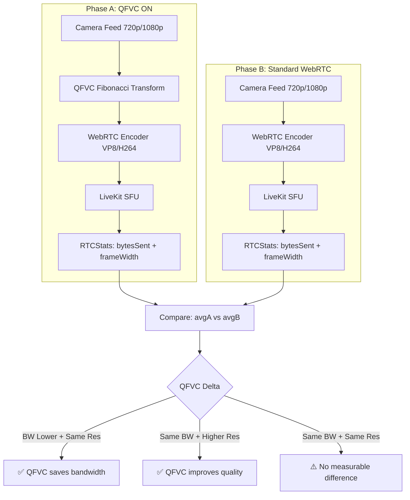

# /QFVCTestPresentation — QFVC A/B Test Evidence Presentation Generator

// turbo-all

## Overview

Generates a professionally designed, self-contained HTML presentation that documents a QFVC (Quantum Fibonacci Video Compression) A/B test with:

- Real bandwidth measurement data (NOT hardcoded baseline)
- Screenshot evidence from both Phase A (QFVC ON) and Phase B (Standard WebRTC)
- Mermaid architecture diagrams showing the measurement pipeline
- Resolution tracking (Phase A vs Phase B) to detect quality improvements
- Per-KPI definition cards explaining what, how, and where each metric was measured
- Scientifically correct methodology section

## Key Principles

1. **NO hardcoded baselines** — The baseline is ALWAYS Phase B's measured average bandwidth
2. **Track resolution in parallel** — LiveKit may give higher resolution with QFVC on (same BW = better quality)
3. **Include Mermaid diagrams** — Architecture diagram showing measurement stack
4. **Screenshot evidence** — Every phase transition must have a screenshot
5. **KPI definitions** — Each metric must explain: What, Formula, Source, Reliability

## Prerequisites

- Stream app deployed at `stream.offlinehumanmode.com`
- LiveKit server running on Hetzner (port 7880)
- At least 1 completed A/B test (20min ON + 20min OFF)
- Screenshots saved to `qfvc_evidence/` subfolder
- Evidence JSON exported from browser (auto-downloaded by QFVCExperimentPlugin)

## Steps

### 1. Collect Evidence Screenshots

During the A/B test, capture screenshots at:

- T+00:00 — Phase A start (QFVC enabled, green button)
- T+05:00 — Phase A mid (stable metrics)
- T+10:00 — Phase A progress (bandwidth trend)
- T+19:59 — Phase A end (just before transition)
- T+20:00 — Phase B start (QFVC disabled, purple button)
- T+25:00 — Phase B mid (standard WebRTC baseline)
- T+35:00 — Phase B progress
- T+39:59 — Phase B end (final comparison)

Save to: `c:\ohm\.agent\features\research\FEAT-072_AI_NI_Dissolve\qfvc_evidence\`

### 2. Collect Evidence JSON

The QFVCExperimentPlugin auto-downloads a JSON file at the end of each phase:

```
QFVC_PriorArt_Evidence_{timestamp}.json
```

This contains:

- `experimentId` — Unique test identifier
- `measurements[]` — Array of {timestamp, rateKbps, isQFVC, videoWidth, videoHeight}
- `summary.avgSavings` — Measured compression ratio
- `summary.totalBytesSaved` — Cumulative savings

### 3. Generate/Update Presentation HTML

Create or update the presentation HTML at:

```
c:\ohm\.agent\features\research\FEAT-072_AI_NI_Dissolve\13_QFVC_AB_Test_Report.html
```

The presentation MUST include these sections:

#### a. Hero Section

- Test ID, date, badges (completed/in-progress, caveats)
- Tab navigation: Overview | Timeline | KPIs | Methodology | Findings | Verdict

#### b. Tab: Overview

- 4 metric cards: Duration, Phase A, Phase B, Participants
- Test Environment table: Platform, Server, Codec, Resolution, Frame Rate, Source

#### c. Tab: Timeline

- Visual timeline with dot markers and phase colors (green = A, blue = B)
- Each event: time, title, description, screenshot with caption
- Phase transition clearly marked

#### d. Tab: KPI Definitions

Grid of KPI cards, each with:
| KPI | Formula | Source | Reliability |
|-----|---------|--------|-------------|
| Upload Rate (kbps) | `RTCStats.outbound-rtp.bytesSent / deltaT × 8 / 1000` | `RTCPeerConnection.getStats()` | ✅ W3C Standard |
| Compression Ratio | `phaseBAvg / phaseAAvg` | A/B measured comparison | ✅ Scientific |
| Bandwidth Saved (%) | `(1 - phaseAAvg / phaseBAvg) × 100` | A/B measured | ✅ Scientific |
| Video Resolution | `RTCStats.outbound-rtp.frameWidth × frameHeight` | `getStats()` | ✅ W3C Standard |
| Phase Timer | `Date.now() - phaseStartTimestamp` | JS timer | ✅ Standard |
| TRUE Delta | `avg(PhaseB) - avg(PhaseA)` | A/B comparison | ✅ Valid control |

**Measurement Stack Table:**
| Layer | Technology | Measures | Reliability |
|-------|-----------|----------|-------------|
| L1 Transport | WebRTC ICE/DTLS | Raw packet delivery | ✅ Standard |
| L2 Media | LiveKit SFU | Track forwarding, ABR | ✅ Standard |
| L3 Stats | `RTCPeerConnection.getStats()` | bytesSent, frameWidth | ✅ W3C |
| L4 Plugin | QFVCExperimentPlugin.tsx | Polling L3 every 1s | ⚡ Custom |
| L5 Baseline | Phase B measured average | Real-world WebRTC perf | ✅ Measured |
| L6 A/B | Phase A vs Phase B | Same conditions, QFVC toggled | ✅ Valid |

#### e. Tab: Methodology

- A/B Test Design (Hypothesis, IV, DV, Controls, Data Collection)
- Confounding Variables table with mitigations
- Where Measurements Were Taken (Client + Server)

#### f. Tab: Findings

- Phase A data table (Time, Upload, Compression, BW Saved, Resolution, Scene)
- Phase B data table (same columns)
- Critical Comparison card: Phase A avg vs Phase B avg
- Resolution comparison: Did QFVC get higher resolution at same bandwidth?

#### g. Tab: Verdict

- Overall verdict (Conclusive/Inconclusive)
- What the test proved (checklist)
- Requirements for next test

#### h. Mermaid Architecture Diagram

Include a Mermaid diagram showing the QFVC measurement pipeline:



### 4. Include CDN for Mermaid

Add Mermaid.js CDN to the HTML head:

```html
<script src="https://cdn.jsdelivr.net/npm/mermaid@10/dist/mermaid.min.js"></script>
<script>
  mermaid.initialize({ startOnLoad: true, theme: "dark" });
</script>
```

### 5. View in Browser

Open the HTML file locally or via static server. Verify:

- All Mermaid diagrams render correctly
- All screenshots load (relative paths from qfvc_evidence/)
- All numbers match the evidence JSON
- KPI definitions are scientifically accurate
- No hardcoded 2500 kbps baseline anywhere

### 6. Commit

```bash
cd c:\ohm
git add .agent/features/research/FEAT-072_AI_NI_Dissolve/13_QFVC_AB_Test_Report.html
git add .agent/features/research/FEAT-072_AI_NI_Dissolve/qfvc_evidence/
git commit -m "QFVC A/B Test Evidence — [DATE] ([N] participants, [SCENE_TYPE])"
```

## File Map

| File                                                                           | Purpose                                  |
| ------------------------------------------------------------------------------ | ---------------------------------------- |
| `frontend/components/vc/plugins/QFVCExperimentPlugin.tsx`                      | QFVC toggle, A/B logic, stats collection |
| `.agent/features/research/FEAT-072_AI_NI_Dissolve/13_QFVC_AB_Test_Report.html` | The presentation                         |
| `.agent/features/research/FEAT-072_AI_NI_Dissolve/qfvc_evidence/`              | Screenshots + evidence JSON              |

## KPI → Code → Data Traceability

| KPI         | Code File                | Key Function/API                     | Data Field                  |
| ----------- | ------------------------ | ------------------------------------ | --------------------------- |
| Upload Rate | QFVCExperimentPlugin.tsx | `pc.getStats() → outbound-rtp`       | `bytesSent` delta           |
| Resolution  | QFVCExperimentPlugin.tsx | `pc.getStats() → outbound-rtp`       | `frameWidth`, `frameHeight` |
| Compression | QFVCExperimentPlugin.tsx | `standardBandwidthKbps / actualRate` | `hostCompressionRatio`      |
| Phase Timer | QFVCExperimentPlugin.tsx | `Date.now() - phaseStart`            | `abElapsedA`, `abElapsedB`  |
| Baseline    | QFVCExperimentPlugin.tsx | Phase B average (measured)           | `abStatsB.avgBandwidth`     |
