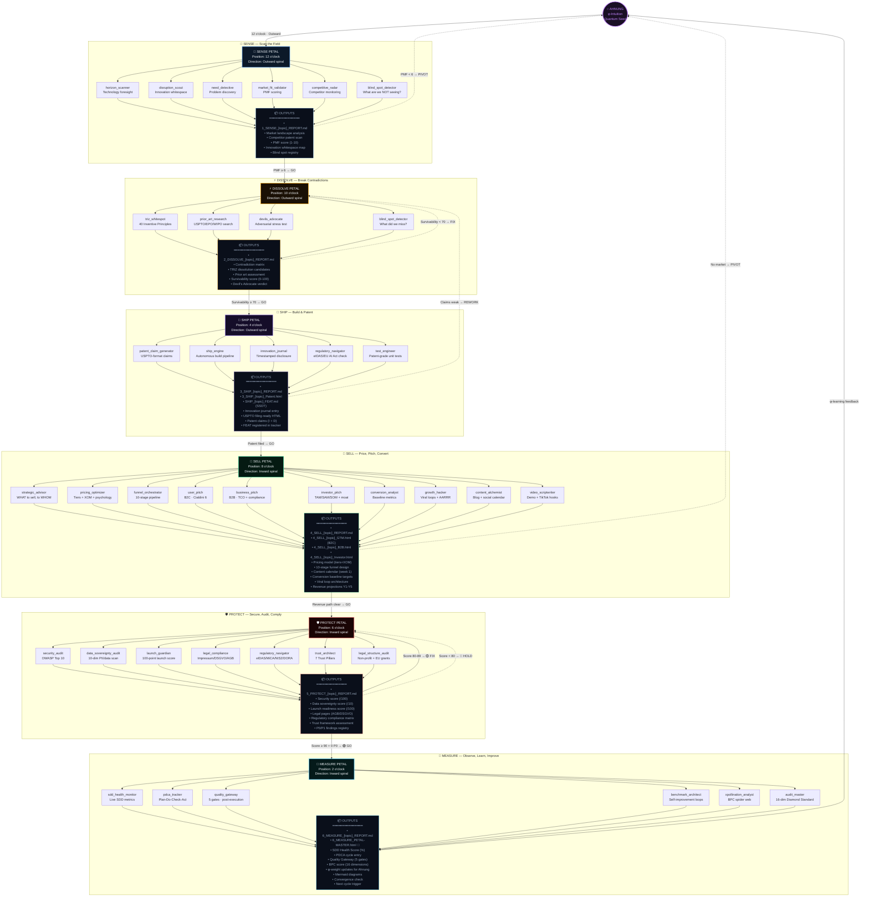
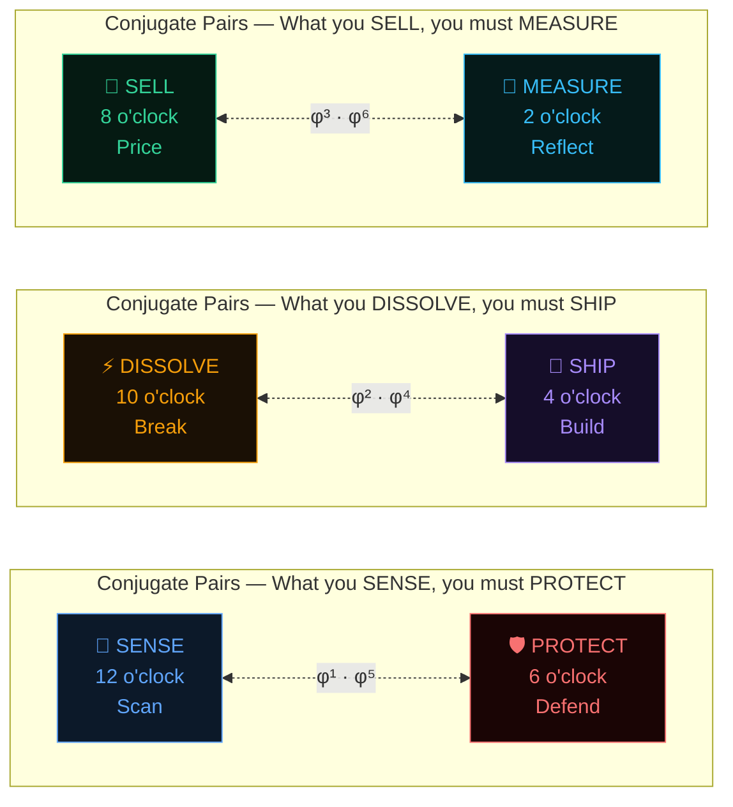
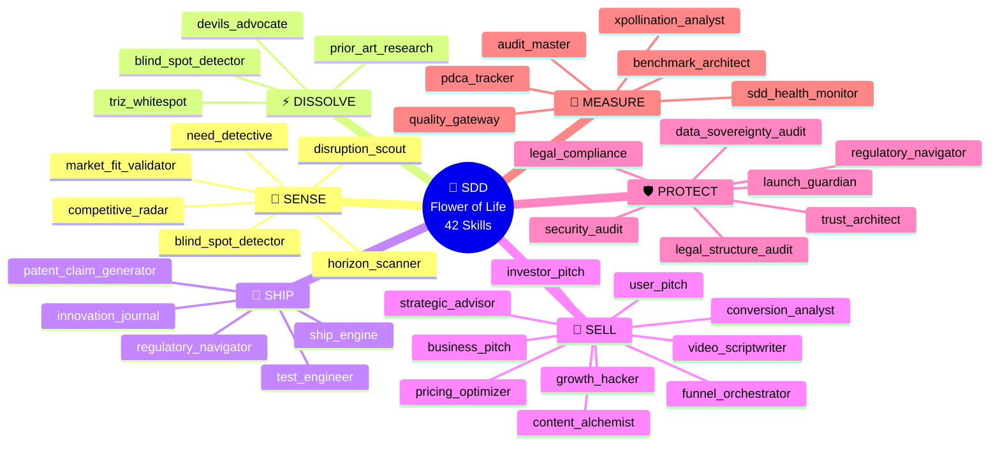

# 🌸 Flower of Life — Skill-Driven Development (SDD) Process

> The complete Mermaid reference for the OHM SDD 6-Petal Cycle.
> Each petal lists its skills, outputs, and gate criteria.

---

## 🌸 Master Flow — The Breathing Flower

---

## 🔗 Phase Conjugate Partners

---

## 🚦 Gate Decisions — Quick Reference

```mermaid
graph TD
    subgraph "SENSE Gate"
        SG{"PMF Score?"}
        SG -->|"≥ 6"| SG_GO["🟢 GO → DISSOLVE"]
        SG -->|"< 6"| SG_PIVOT["🔴 PIVOT → new topic"]
    end

    subgraph "DISSOLVE Gate"
        DG{"Survivability?"}
        DG -->|"≥ 70%"| DG_GO["🟢 GO → SHIP"]
        DG -->|"< 70%"| DG_FIX["🟡 FIX → re-dissolve"]
    end

    subgraph "SHIP Gate"
        HG{"Patent Quality?"}
        HG -->|"Claims filed"| HG_GO["🟢 GO → SELL"]
        HG -->|"Claims weak"| HG_FIX["🟡 REWORK → DISSOLVE"]
    end

    subgraph "SELL Gate"
        EG{"Revenue Path?"}
        EG -->|"Clear GTM"| EG_GO["🟢 GO → PROTECT"]
        EG -->|"No market"| EG_PIVOT["🔴 PIVOT → SENSE"]
    end

    subgraph "PROTECT Gate"
        PG{"Launch Score?"}
        PG -->|"≥ 90 + 0 P0"| PG_GO["🟢 GO → MEASURE"]
        PG -->|"80-89"| PG_FIX["🟡 FIX P0/P1"]
        PG -->|"< 80"| PG_HOLD["🔴 HOLD"]
    end

    subgraph "MEASURE Gate"
        MG{"SDD Health?"}
        MG -->|"≥ 90%"| MG_BLOOM["🌸 BLOOMING"]
        MG -->|"75-89%"| MG_GROW["🌿 GROWING"]
        MG -->|"60-74%"| MG_SPROUT["🌱 SPROUTING"]
        MG -->|"< 60%"| MG_SEED["🌰 SEEDING"]
    end

    style SG_GO fill:#051a12,stroke:#22c55e,color:#22c55e
    style DG_GO fill:#051a12,stroke:#22c55e,color:#22c55e
    style HG_GO fill:#051a12,stroke:#22c55e,color:#22c55e
    style EG_GO fill:#051a12,stroke:#22c55e,color:#22c55e
    style PG_GO fill:#051a12,stroke:#22c55e,color:#22c55e
    style MG_BLOOM fill:#051a12,stroke:#22c55e,color:#22c55e
    style SG_PIVOT fill:#1a0505,stroke:#ef4444,color:#ef4444
    style EG_PIVOT fill:#1a0505,stroke:#ef4444,color:#ef4444
    style PG_HOLD fill:#1a0505,stroke:#ef4444,color:#ef4444
    style MG_SEED fill:#1a0505,stroke:#ef4444,color:#ef4444
```

---

## 📊 Complete Skill Inventory per Petal

---

## 📁 File Naming Convention

```mermaid
graph LR
    subgraph "FEAT Folder: Documentation/features/research/FEAT-XXX_[topic]/"
        F1["1_SENSE_[topic]_REPORT.md"]
        F2["2_DISSOLVE_[topic]_REPORT.md"]
        F3["3_SHIP_[topic]_REPORT.md"]
        F3b["3_SHIP_[topic]_Patent.html"]
        F3c["SHIP_[topic]_FEAT.md"]
        F4["4_SELL_[topic]_REPORT.md"]
        F4b["4_SELL_[topic]_GTM.html"]
        F4c["4_SELL_[topic]_B2B.html"]
        F4d["4_SELL_[topic]_Investor.html"]
        F5["5_PROTECT_[topic]_REPORT.md"]
        F6["6_MEASURE_[topic]_REPORT.md"]
        F6b["6_MEASURE_PETAL-MASTER.html 🌸"]
    end

    style F6b fill:#1a1025,stroke:#c084fc,stroke-width:3px,color:#c084fc
```

