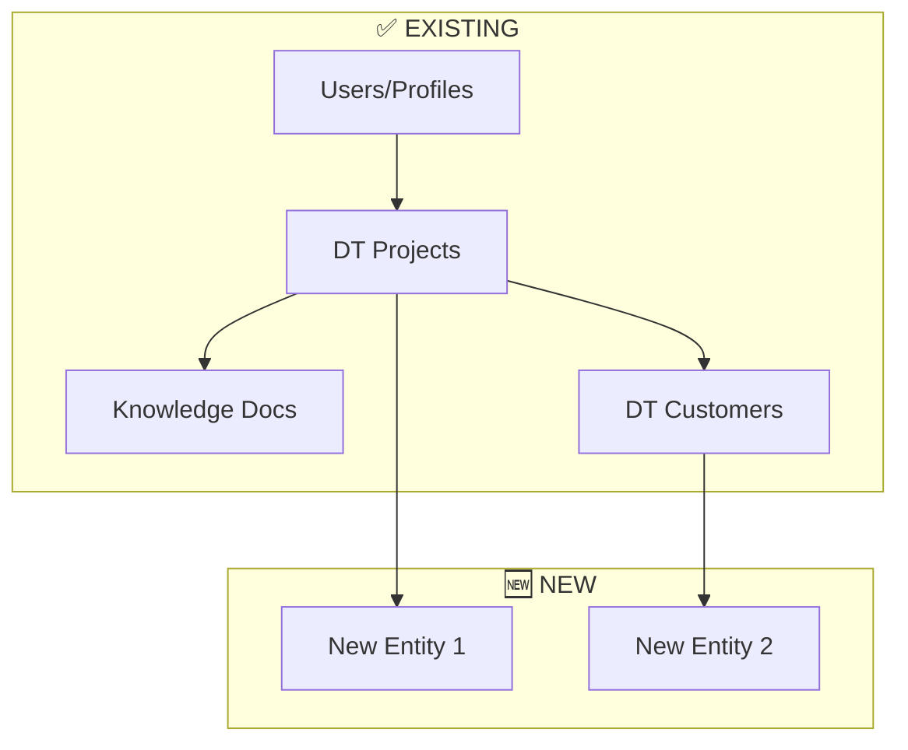

# /strategycreation - OHM Feature Strategy Workflow

> **🧠 SKILL REQUIRED:** Before executing this workflow, read the **Strategy Architect** skill at `.agent/skills/strategy_architect/SKILL.md` for ELWMS component mapping, onion level classification, AI-first design patterns, and reuse identification protocol.

**Philosophy:** "DT & AI Agent First" - Every new feature should consider how it integrates with the Digital Twin ecosystem and Clawdbot AI.

// turbo-all

---

## 🎯 Purpose

This workflow creates **comprehensive strategy documents** for new OHM features that:

1. Prevent double-building by checking existing infrastructure
2. Integrate with ELWMS (the "One System") architecture
3. Use Clawdbot as the AI backbone for automation
4. Feel tailored to specific use cases while being generic enough to cover multiple scenarios
5. Produce artifacts that feed directly into `/implementation` plans

---

## 📋 Prerequisites

Before starting, ensure you have:

- [ ] A clear feature request or requirement document
- [ ] Access to the existing codebase for research
- [ ] Understanding of the user's business context

---

## 🔍 Phase 1: Context Discovery

### Step 1.1: Research Existing Infrastructure

```bash
# Check what already exists in the OHM ecosystem
# Search for related entities, services, and components
```

**Action Items:**

1. **Search for existing entities** that match the new requirements
2. **Identify reusable services** (auth, billing, documents, etc.)
3. **Check existing portals** (App, Twin, Stream, Retreat) for placement
4. **Review ELWMS architecture** for integration points

**Files to Check:**

- `Documentation/Specs/DT_CRM_SPECIFICATION.md` - Onion architecture
- `Documentation/Plans/ELWMS_Implementation_Roadmap.md` - Current capabilities
- `Documentation/AS_BUILD/` - What's already implemented
- `backend/src/` - Existing entities and services
- `frontend/components/` - Existing UI components

### Step 1.2: Map to ELWMS Components

Every feature should map to one or more ELWMS components:

| Component               | Role                 | Consider For                   |
| ----------------------- | -------------------- | ------------------------------ |
| **🧠 Brain (Clawdbot)** | AI & Decision Making | Automation, Chat, RAG          |
| **🗣️ Voice (LiveKit)**  | Communication        | Calls, Video, Streaming        |
| **📣 Herald (Social)**  | Outreach             | Marketing, Notifications       |
| **🏢 CRM (Projects)**   | Relationships        | Customers, Contracts, Advisors |
| **💰 Blissconomy**      | Monetization         | Payments, XOM, Billing         |

### Step 1.3: Identify Reuse Opportunities

**CRITICAL: Prevent Double-Building!**

Check these existing systems:

- **User Management:** `backend/src/user/` + `backend/src/auth/`
- **Document Storage:** `backend/src/knowledge/` (RAG-enabled)
- **Payments:** `backend/src/billing/` + `backend/src/payments/`
- **CRM Entities:** `backend/src/digital-twin/` (Projects, Customers, Members)
- **Onion Security:** Already implemented in DT CRM
- **Calendar/Tasks:** `backend/src/calendar/`
- **Mail Integration:** `backend/src/mail/` + `backend/src/email/`
- **Notifications:** SSE/WebSocket in various services

---

## 🏗️ Phase 2: Strategic Architecture

### Step 2.1: Define Entity Relationships

Map new data models to existing onion architecture:



### Step 2.2: Define AI Integration Points

For EVERY new feature, consider:

1. **Clawdbot Chat Integration**

   - Can users interact with this feature via TwinChat?
   - What prompts/intents should be supported?

2. **RAG Knowledge Base**

   - Should documents be "Feed to Twin" enabled?
   - What onion level should different data have?

3. **AI Automation**

   - Can Clawdbot automate repetitive tasks?
   - What decisions can be AI-assisted?

4. **AI Summarization**
   - Can Clawdbot generate reports/summaries?
   - Can it extract insights from data?

### Step 2.3: Define Onion Level Mapping

Map all new data to appropriate access levels:

| Data Type        | Onion Level | Who Can See       |
| ---------------- | ----------- | ----------------- |
| Public Info      | L0          | Everyone          |
| Customer-Visible | L1          | Customers + Inner |
| Partner-Visible  | L2          | Partners + Inner  |
| Team-Internal    | L3          | Team + Inner      |
| Admin-Only       | L4          | Admins + Creator  |
| Creator-Only     | L5          | Creator Only      |

---

## 📝 Phase 3: Strategy Document Creation

### Step 3.1: Create Strategy File

Create file at: `Documentation/Strategies/[FEATURE_NAME]_STRATEGY.md`

**Template:**

```markdown
# 🎯 [FEATURE_NAME] Strategy Document

**Version:** 1.0.0
**Created:** [DATE]
**Status:** Strategy Created
**Related:** ELWMS, DT CRM, Clawdbot
**Original Request:** [Link to Annex or inline]

---

## 1. Executive Summary

[Brief overview of what this feature does and why]

## 2. Business Requirements

[Extracted from original request]

## 3. ELWMS Integration Analysis

### 3.1 Existing Components to Reuse

### 3.2 New Components Required

### 3.3 Clawdbot Integration Points

## 4. Data Architecture

### 4.1 New Entities

### 4.2 Relationship to Existing Entities

### 4.3 Onion Level Mapping

## 5. AI-First Features

### 5.1 Chat Integration

### 5.2 Automation Opportunities

### 5.3 RAG Knowledge Integration

## 6. UI/UX Strategy

### 6.1 Portal Placement

### 6.2 Component Reuse

### 6.3 New Components Required

## 7. Security & Permissions

### 7.1 Access Levels

### 7.2 Data Encryption

### 7.3 GDPR Considerations

## 8. Implementation Priorities

### 8.1 Phase 1: [MVP]

### 8.2 Phase 2: [Enhanced]

### 8.3 Phase 3: [AI Integration]

## 9. Next Steps

→ Ready for `/implementation` plan creation

---

## ANNEX A: Original Request

[Full original requirement text preserved for implementation context]
```

### Step 3.2: Validate Against Best Practices

Cross-check with `/bestpractice`:

- [ ] Architecture scales to 1000+ users
- [ ] Plugin-based approach (not monolithic)
- [ ] Security-first design
- [ ] Mobile/Tablet/Desktop support
- [ ] Documentation planned

Cross-check with `/newportal`:

- [ ] Auth patterns considered (JWT + Wallet)
- [ ] CORS configuration planned
- [ ] API endpoints dual-mode ready

---

## 🔗 Phase 4: Link to Implementation

### Step 4.1: Generate Implementation Handoff

The strategy document should contain enough detail for `/implementation` to generate:

1. Database migrations
2. Backend entities & services
3. API endpoints
4. Frontend components
5. Clawdbot integration hooks

### Step 4.2: Preserve Original Context

**CRITICAL:** Always include the full original request as ANNEX.
The implementation agent needs the full context to make correct decisions.

---

## ✅ Checklist Before Completion

- [ ] Searched existing codebase for reuse opportunities
- [ ] Mapped to ELWMS components
- [ ] Defined Clawdbot integration points
- [ ] Created onion level mapping
- [ ] Checked against `/bestpractice`
- [ ] Included original request as ANNEX
- [ ] Strategy document saved to `Documentation/Strategies/`

---

## 📁 Output Artifacts

1. **Strategy Document:** `Documentation/Strategies/[FEATURE]_STRATEGY.md`
2. **Entity Diagram:** (Optional Mermaid in strategy doc)
3. **Integration Matrix:** (Table in strategy doc)

---

## 🔄 Related Workflows

- **`/bestpractice`** - Architecture & quality standards
- **`/newportal`** - Portal/Auth integration
- **`/implementation`** - Turn strategy into code (next step)
- **`/clawdbot`** - AI integration specifics
- **`/vcplugin`** - VC/Stream features

---

## 💡 Pro Tips

1. **Start with "What AI Can Do"** - Before designing CRUD, think about what Clawdbot can automate.
2. **Check Entity Names** - Search for similar entities before creating new ones.
3. **Think Onion** - Every piece of data has a trust level. Define it early.
4. **Generic + Specific** - Build generic infrastructure, configure for specific use cases.
5. **ANNEX is Gold** - The original request is the source of truth for implementation.

---

**Usage:** `/strategycreation` or `@[/strategycreation]`
**Created:** 2026-01-26
**Author:** OHM Development
