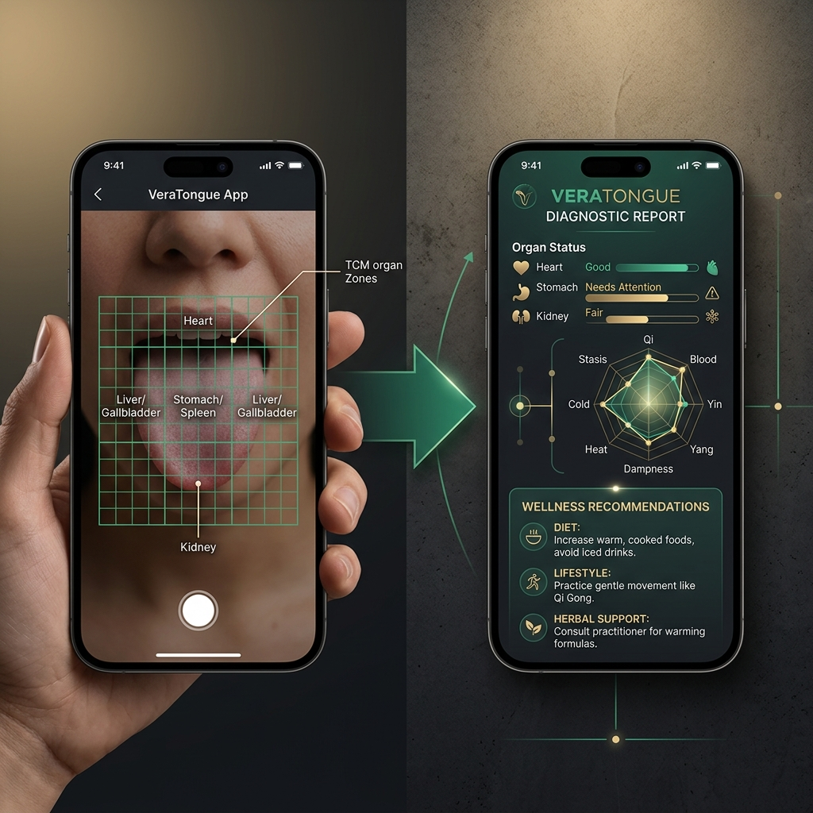
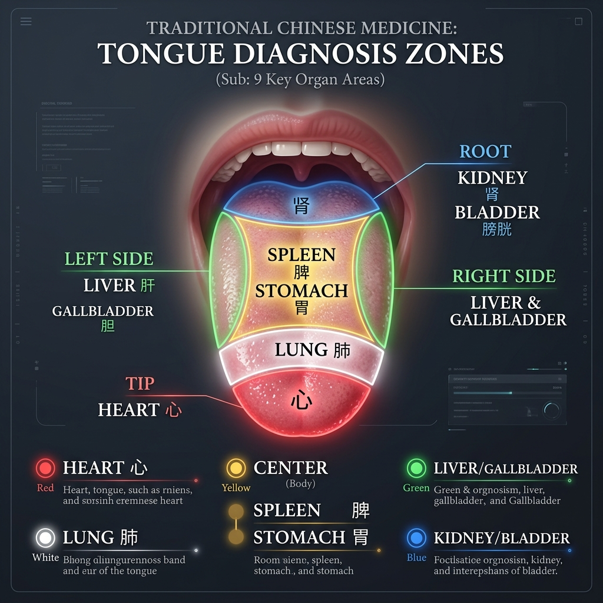
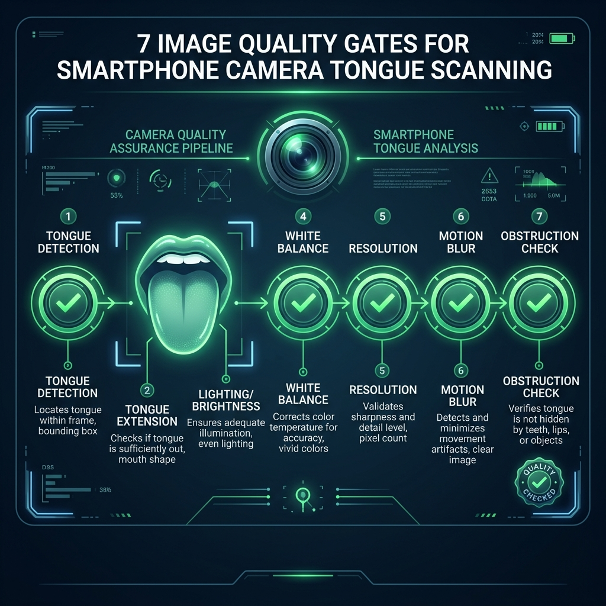
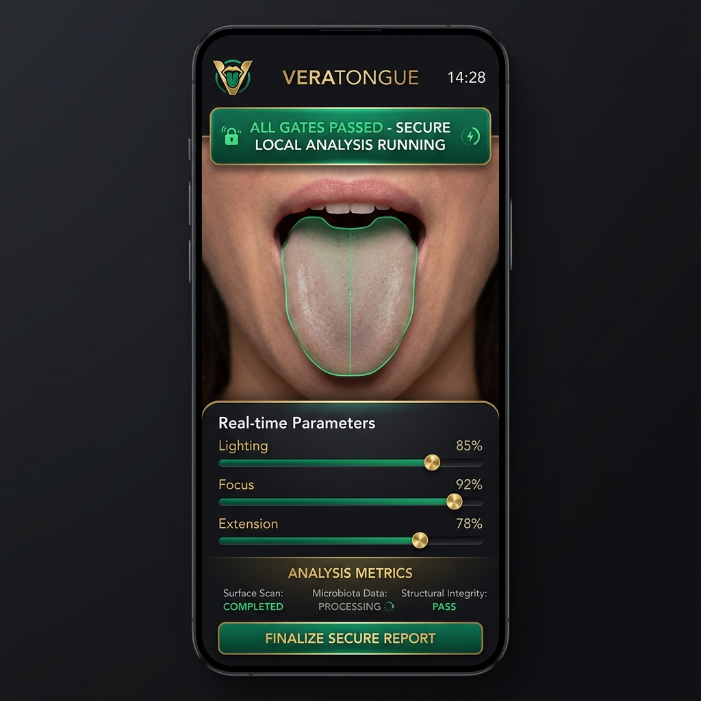

# VeraTongue: Sovereign On-Device Tongue Analysis & Computer Vision

### ⚡ Executive Summary
VeraTongue implements a zero-cloud, 100% on-device biometric analysis engine that maps the surface of the human tongue to internal organ health states. By applying the classical TCM topography of Giovanni Maciocia through advanced localized computer vision (TRIZ-optimized canvas heuristics), the system bypasses cloud dependency and privacy leaks, delivering immediate, high-fidelity physiological feedback.

---

*VeraTongue's on-device scanning view: real-time camera grid alignment combined with localized biomarker indicators.*

---

## Start with WHY: The Diagnostic Mirror in Your Pocket
For the average person on the street, tracking daily wellness is an exercise in guesswork. We wear smartbands to count our steps and measure our heart rate, but these metrics only scratch the surface of our metabolic and constitutional health. How do we know if our digestive system is struggling, if our body is chronically dehydrated, or if we are carrying systemic inflammation before symptoms arise?

For over two thousand years, Eastern medicine has utilized a natural diagnostic mirror: the human tongue. In Traditional Chinese Medicine (TCM), the tongue body and its coating act as a visible dashboard of the internal organs. Because the tongue has an extremely rich vascular supply and is constantly bathed in saliva, changes in systemic circulation, hydration, and cellular turnover are immediately reflected on its surface.

**VeraTongue** translates this ancient diagnostic wisdom into modern digital reality. By turning your smartphone camera into a secure, private physiological scanner, it provides a direct window into your internal balance—completely locally, with zero data sent to external servers.

> **"The tongue does not lie. It is an external extension of the internal visceral environment, mapping hydration, blood stasis, and metabolic heat in real time."**
> — Traditional Chinese Medicine Topography Principles

---

## Technological Foundation: The `tongue_analyst` Engine
At the heart of the system lies the `tongue_analyst` engine, which integrates classical organ mapping with rigid computer vision validations. The analysis is structured across three core layers: the 7 Image Quality Gates, the 9-Zone Topographical Map, and the 8 Diagnostic Dimensions.

### 1. The 7 Non-Negotiable Quality Gates
Clinical reliability is highly sensitive to input variables. To prevent false readings due to motion, poor illumination, or camera angle, the engine forces the user's input through 7 sequential quality filters before executing any diagnostic logic:

1. **Tongue Detection:** Samples pixels in the guide overlay boundary to identify tongue-colored ranges (R > G * 1.15 and R > B * 1.15 for >= 10% of pixels).
2. **Tongue Extension:** Ensures the tongue extends to fill at least 40% of the guide overlay height, confirming the Kidney area (root) is fully exposed.
3. **Brightness Check:** Validates that average pixel brightness (Luminosity scale 0–255) is strictly between 45 and 220 to prevent overexposure or deep shadow.
4. **White Balance Gate:** Verifies the ratio of Blue to Red channels (mean B / mean R must be between 0.5 and 1.5) to filter out colored ambient lighting, aligning the sensor with the D65 daylight standard.
5. **Resolution Check:** Rejects camera inputs below 640x480 pixels.
6. **Sharpness Gate (Motion Blur):** Uses grayscale Laplacian variance checks to block frames with motion blur (variance threshold < 100).
7. **Obstruction Check:** Scans the upper 15% of the frame to ensure lips, teeth, or fingers do not block the root of the tongue (triggering if >80% skin-tone pixels are present).

---

### 2. The Maciocia Tongue Map (9 Organ Zones)
Once the image passes all 7 gates, the canvas is mapped using coordinate divisions corresponding to Giovanni Maciocia's classical guidelines:

* **Z1 (Heart):** 0–8% from tip, center 50% width (Upper Burner)
* **Z2 (Lung):** 8–25% from tip, center 60% width (Upper Burner)
* **Z3-L (Liver):** Left side, 25–65% height, left 25% width (Middle Burner)
* **Z3-R (Gallbladder):** Right side, 25–65% height, right 25% width (Middle Burner)
* **Z4 (Spleen & Stomach):** Center, 25–65% height, center 50% width (Middle Burner)
* **Z5 (Kidney):** 65–100% height (root), center 70% width (Lower Burner)
* **Z6 (Deep Root):** Deep root, representing Bladder & Intestines (Lower Burner)

---

### 3. The 8 Diagnostic Dimensions
The local algorithm extracts features from each zone and maps them across 8 dimensional axes:
* **Body Color:** Analyzes blood flow and vascular density.
* **Shape:** Measures muscular tone and tissue volume (swollen vs. thin).
* **Tooth Marks:** Detects lateral scalloping caused by Spleen Qi deficiency.
* **Coating:** Evaluates oral flora, mucous buildup, thickness, color, and root.
* **Cracks & Fissures:** Identifies structural changes and fluid depletion.
* **Sublingual Veins:** Evaluates venous pressure and microcirculation (blood stasis).
* **Moisture:** Measures salivary gland output.
* **Movement & Tremor:** Checks neuromotor stability (internal wind).

---

## Visual Evidence Gallery

*Figure 1: The Maciocia organ-zone topography as segmented by the computer vision system.*

*Figure 2: Sequential verification of the 7 image quality gates before analysis execution.*

*Figure 3: Clean, high-fidelity dark interface showing on-device analysis and real-time parameters.*

---

## TRIZ Contradictions Dissolved
Developing a high-performance clinical tool that runs entirely within consumer hardware presented multiple fundamental engineering trade-offs. The development team resolved these using the TRIZ framework:
1. **Clinical Accuracy vs. Consumer Camera Variability:** Resolved via *Principle 35 (Parameter changes)*. By introducing the 7-gate validation system, the software rejects inconsistent, blurry, or badly illuminated images at the point of capture, maintaining a clean diagnostic input baseline.
2. **Deep Organ Mapping vs. Serverless Privacy:** Resolved via *Principle 1 (Segmentation)*. The tongue's bounding box is segmented into dedicated canvases. These sub-canvases are processed locally in Lab color space using K-means clustering, keeping the raw biometric data inside the device's volatile memory.
3. **Scientific Integrity vs. Non-Medical Regulatory Constraints:** Resolved via *Principle 17 (Another dimension)*. The generated output strictly separates traditional constitutional patterns from Western physiological indicators, making it an educational wellness tool rather than a regulated medical device.

---

## Open Questions for the Community
As we refine the `tongue_analyst` framework, we invite practitioner and developer input:
* How does ambient lighting variability affect the sublingual vein classification, and can we improve calibration beyond standard red/blue ratios?
* What are the most effective visual indicators for distinguishing constitutional cracks from temporary, stress-induced cracks?

---

*Visual Signature: The integration of natural intelligence, crystalline structure, and organic harmony.*

---

*Developed by [DESTILL.ai](https://destill.ai) | Sovereign Health Mirror™*

*For IP licensing inquiries: **IP@destill.ai***

*Connect on LinkedIn: [Hagen Befragen](https://www.linkedin.com/in/hagen-befragen) & [DESTILL.ai](https://www.linkedin.com/company/destill-ai)*

---

### Vereinshinweis
Die angebotenen Wellness-Analysen und Programme erfolgen im Rahmen des gemeinnützigen Vereins **Lebensfluss e.V.** (ZVR-Zahl: 1758759096, Sitz in Österreich). Die erbrachten Analysen dienen der Gesundheitsförderung und stellen keine ärztliche Diagnostik oder Therapie dar. Die Teilnahme erfolgt auf Basis eines Kostenbeitrags der Vereinsmitglieder.
