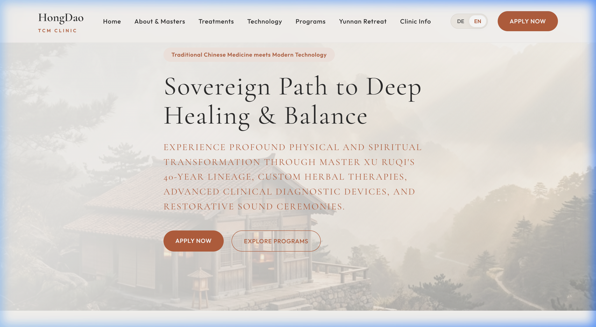
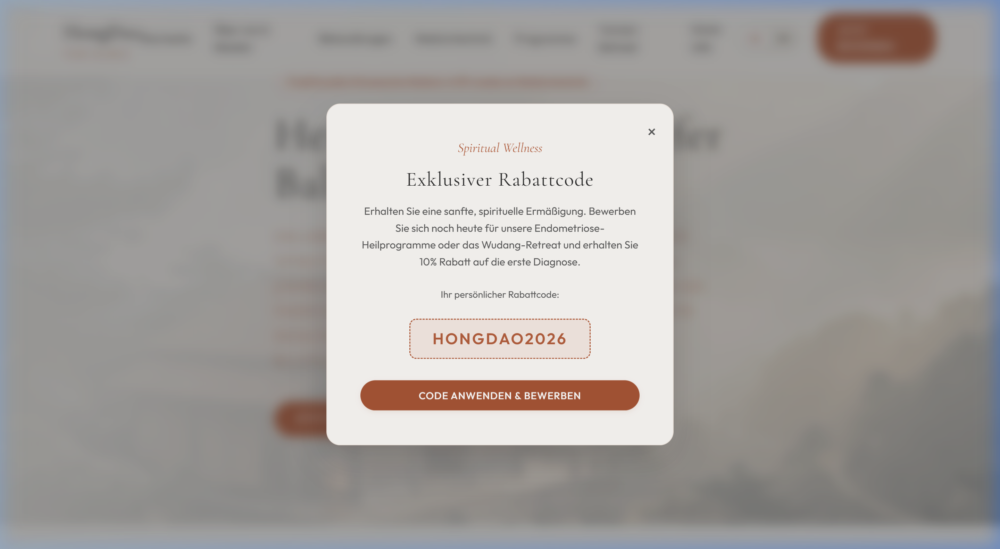
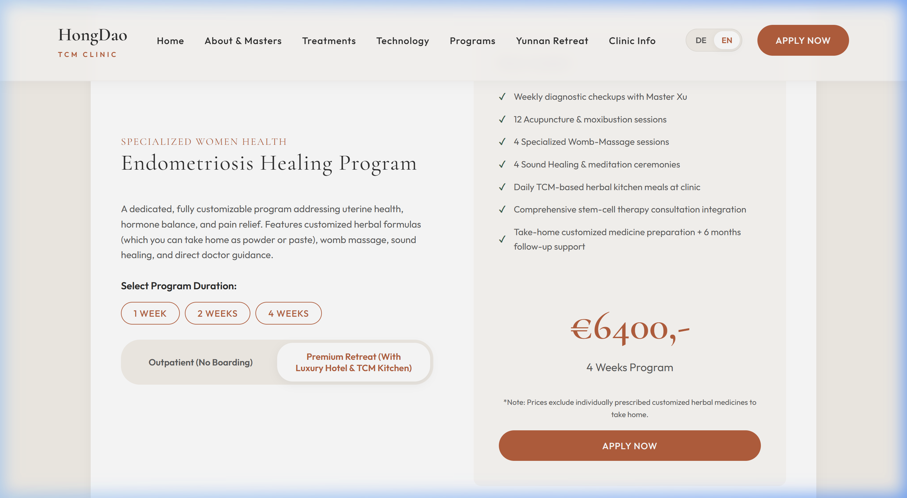
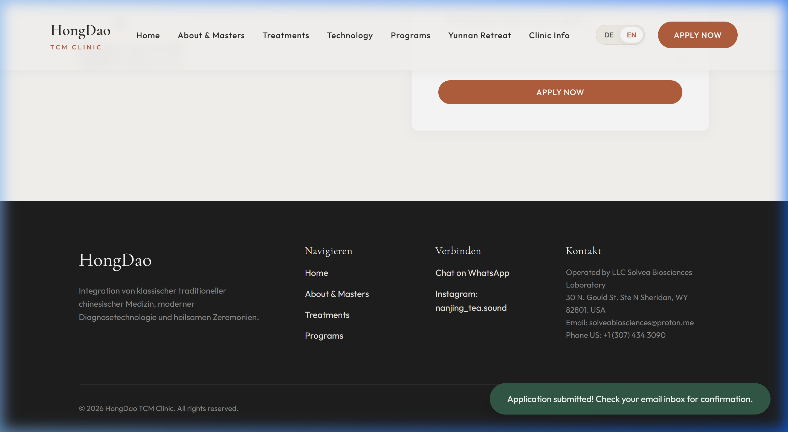

# Visual Walkthrough: HongDao TCM Clinic Web Application

This document provides a guided walkthrough of the newly developed website for the **HongDao TCM Clinic**, showing key features, visual design implementation, and user experience flows.

---

## Interactive Feature Tour

````carousel

<!-- slide -->

<!-- slide -->

<!-- slide -->

````

---

### Step-by-Step UI Verification

### 1. Home / Hero Banner
- **Aesthetic:** Features a minimalist layout with soft warm text overlays on a panoramic background of the Wudang Mountains. The custom typography uses the elegant **Cormorant Garamond** for headings and **Outfit** for clean body text.
- **Language Switcher:** A smooth toggling header bar instantly shifts all content from German to English (and vice versa) without refreshing the webpage.

### 2. Marketing Promo Pop-up
- **Trigger:** Fades in smoothly after a 2.5-second delay.
- **Tone:** Speaks in a warm, spiritual tone to welcome users, offering a **10% discount** code (`HONGDAO2026`) that auto-fills into the contact form when clicking the apply button.

### 3. Endometriosis Program Pricing Calculator
- **Customization:** Users can select between **1 Week**, **2 Weeks**, and **4 Weeks** programs.
- **Tiers:** Toggles between **Outpatient** (ambulant care) and **Premium Retreat** (which includes luxury partner boarding and herbal kitchen meals).
- **Price Matrix:** Updates prices in real-time, detailing the specific list of services included for each selection.

### 4. Appointment Scheduler & Form Validation
- **Constraint Checks:** Users are instructed to select Wednesdays or Saturdays for free consultations. Selecting any other day displays an error alert.
- **Slot Allocation:** Selecting a valid day instantly generates a list of 12 booking slot buttons from 14:00 to 20:00 Chinese Standard Time.
- **Confirmation Flow:** Submitting the form shows a successful confirmation toast notifying the user that a confirmation email will be sent automatically.
